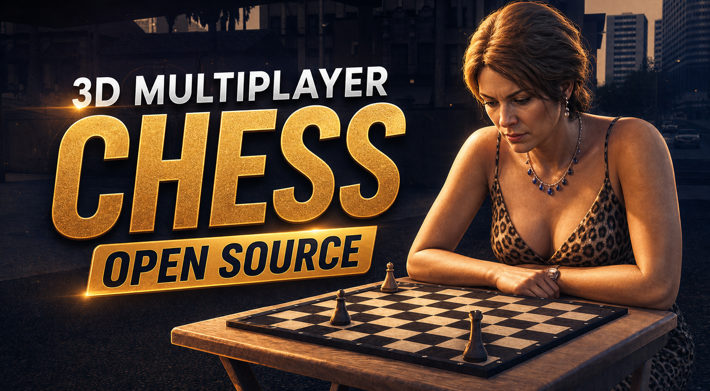
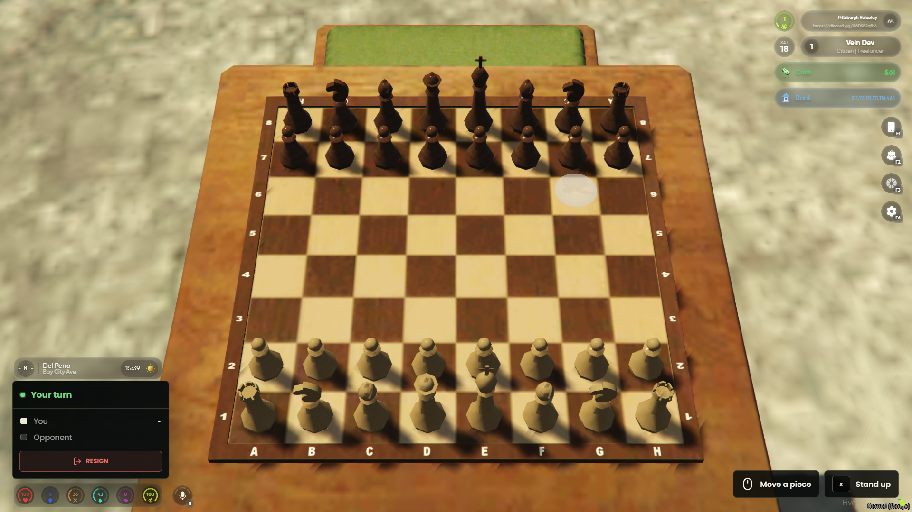

# Peak Chess



<p align="center">
  <strong>Playable 3D chess tables for FiveM — PvP, AI, spectators, wagers, and a fully open-source NUI.</strong>
</p>

<p align="center">
  <a href="LICENSE"></a>
  <a href="version.json"></a>
  <a href="https://github.com/Peak-Studios/peak-chess"></a>
  <a href="https://dsc.gg/peakstudios"></a>
</p>

Peak Chess is a standalone-first FiveM chess resource built for real in-world matches. Players can sit at a 3D table, challenge another player or an AI opponent, spectate active games, wager through an optional framework integration, and play a fully validated game of chess without leaving the world.

The complete Lua, chess engine, integration layer, and React/Vite interface are released under the MIT license. No escrow. No required framework. No database.

Full hosted documentation is available at [peakrp.net/docs/peak-chess](https://peakrp.net/docs/peak-chess).



## Features

- Complete chess rules: legal move validation, check, checkmate, stalemate, castling, en passant, promotion, resignation, and draw handling
- Player-versus-player tables with seat selection and ready states
- Configurable AI matches with easy, medium, and hard engine profiles
- Spectator support for active tables
- Optional cash wagers with server-side validation, payout, refund, and house-cut handling
- Modern React/Vite NUI for the lobby, match HUD, promotion picker, and result state
- Standalone operation with no mandatory framework, target system, database, or bridge
- Optional `peak-bridge`, ESX, QBCore, and Qbox integrations
- Optional `ox_target`, `qb-target`, and `var-interact` support
- Dependency-free draw-text interaction available by default
- Configurable tables, camera, seating, models, controls, sounds, markers, spotlights, AI profiles, and locale
- English and French locales included
- Server and client exports for integration with other resources
- Restart-safe cleanup for spawned tables, chairs, pieces, cameras, peds, and NUI state

## Requirements

- A FiveM server using the `cerulean` FXv2 runtime
- The `bzzz_chess` prop pack containing the configured table, board, chair, piece, and animation assets

Everything else is optional. Peak Chess does not require SQL, `ox_lib`, a framework, a target resource, or `peak-bridge`.

## Installation

1. Download or clone this repository into your server resources as `peak-chess`.
2. Install the `bzzz_chess` prop pack.
3. Ensure the prop pack before Peak Chess in `server.cfg`:

```cfg
ensure your_bzzz_chess_prop_pack
ensure peak-chess
```

4. Open [`shared/sh.lua`](shared/sh.lua) and configure your tables, framework mode, interaction system, wagers, and AI settings.
5. Restart the server and approach a configured chess table.

If you use `peak-bridge`, load it first:

```cfg
ensure peak-bridge
ensure your_bzzz_chess_prop_pack
ensure peak-chess
```

See [INSTALL.md](INSTALL.md) for the complete setup walkthrough.

## Configuration

The main configuration lives in [`shared/sh.lua`](shared/sh.lua).

```lua
Config.Locations = {
    { coords = vec3(-1319.881348, -925.411011, 10.19995), heading = 104.881889, blip = true },
}

Config.Target.system = 'drawtext' -- auto, ox_target, qb-target, or var-interact

Config.Betting = {
    enabled  = true,
    account  = 'cash',
    min      = 0,
    max      = 50000,
    presets  = { 0, 100, 500, 1000, 5000 },
    houseCut = 0.0,
    drawRefund = true,
}
```

Standalone servers can always play zero-wager chess. Non-zero wagers are exposed only when a supported money provider is available.

## Supported Integrations

| Category | Supported options |
| --- | --- |
| Framework / money | Standalone, `peak-bridge`, ESX, QBCore, Qbox |
| Interaction | Draw text, `ox_target`, `qb-target`, `var-interact` |
| UI | React 19 + Vite, bundled locally for FiveM NUI |
| Persistence | None required; matches are live server state |

Automatic framework detection prefers `peak-bridge`, then ESX, QBCore/Qbox, and finally standalone mode. Every gameplay payload is validated by the server; the browser UI is never treated as authoritative.

## Controls

| Control | Action |
| --- | --- |
| `E` | Open or interact with a chess table |
| Mouse | Aim at and select board squares |
| Left click | Select a piece or legal destination |
| Right click | Cancel the current selection |
| `X` | Stand up / leave the table |
| `Esc` | Close the lobby |

Controls are configurable in `Config.Target` and `Config.Interact`.

## UI Development

The editable NUI source is in [`web/src`](web/src). FiveM loads the compiled bundle from `web/build`.

```powershell
cd web
npm install
npm run build
```

Browser-safe preview states are available during development:

```text
http://localhost:5173/?debug=lobby
http://localhost:5173/?debug=hud
http://localhost:5173/?debug=promotion
http://localhost:5173/?debug=result
http://localhost:5173/?debug=all
```

While any debug preview is open, press `1` for the lobby, `2` for the HUD, `3` for promotion, `4` for the result banner, or `5` for the combined state.

Keep `web/build` in release archives and do not distribute `web/node_modules`.

## Documentation

- [Hosted Peak Chess documentation](https://peakrp.net/docs/peak-chess)
- [Installation guide](INSTALL.md)
- [Full configuration and API reference](docs/documentation.md)
- [AI-assisted server setup prompt](PROMPT.md)
- [Changelog](CHANGELOG.md)
- [Security policy](SECURITY.md)
- [Contributing guide](CONTRIBUTING.md)

## Open Source

Peak Chess is licensed under the [MIT License](LICENSE). You can use it, inspect it, modify it, and submit improvements. Pull requests and reproducible bug reports are welcome.

Built by [Peak Studios](https://github.com/Peak-Studios).
